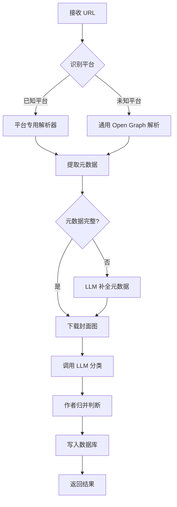

# InfoMind - 个人知识管理系统 PRD

> **版本**: v1.0  
> **日期**: 2026-03-26  
> **作者**: InfoMind Team

---

## 1. 产品概述

### 1.1 愿景

InfoMind 是一款面向个人用户的知识管理系统，旨在将用户日常在各大平台（X/推特、小红书、Bilibili、YouTube、知乎等）收藏但没时间消化的内容进行**自动收集、智能分类、可视化展示**。系统以"书架"为核心隐喻，将零散的网络内容组织成一本本"知识之书"，让碎片化信息变得有结构、可回溯、易检索。

### 1.2 核心价值

| 价值维度 | 描述 |
|---------|------|
| **降低信息焦虑** | 把"待看列表"从脑子里卸载到系统中，安心稍后阅读 |
| **自动化整理** | 大模型自动识别内容来源、行业类别、作者归属，无需手动打标签 |
| **沉浸式浏览** | 书架式 UI 让知识管理本身成为一种享受 |
| **无缝集成** | 天然适配 OpenClaw Agent，支持 CLI 和消息转发 |

### 1.3 目标用户

- 日常关注多平台内容、但没时间即时消化的知识工作者
- 使用 OpenClaw 作为日常 AI 助手的用户
- 喜欢对信息进行结构化管理的效率爱好者

---

## 2. 系统架构

### 2.1 技术架构总览

```
┌─────────────────────────────────────────────────────────┐
│                     用户交互层                           │
│  ┌──────────┐  ┌──────────────┐  ┌───────────────────┐  │
│  │ Web UI   │  │ OpenClaw     │  │ CLI Tool          │  │
│  │ (书架)   │  │ (Agent转发)  │  │ (infomind cmd)    │  │
│  └────┬─────┘  └──────┬───────┘  └────────┬──────────┘  │
│       │               │                   │              │
├───────┴───────────────┴───────────────────┴──────────────┤
│                     API 网关层                            │
│              REST API + Webhook Endpoint                 │
├──────────────────────────────────────────────────────────┤
│                     业务逻辑层                            │
│  ┌──────────┐  ┌──────────┐  ┌──────────┐  ┌─────────┐  │
│  │ 链接解析  │  │ 内容抓取  │  │ LLM 智能  │  │ 分类引擎 │ │
│  │ Service  │  │ Service  │  │ Service  │  │ Service │  │
│  └──────────┘  └──────────┘  └──────────┘  └─────────┘  │
├──────────────────────────────────────────────────────────┤
│                     数据持久层                            │
│        SQLite / JSON File + 封面图缓存                    │
└──────────────────────────────────────────────────────────┘
```

### 2.2 技术选型

| 层级 | 技术 | 理由 |
|------|------|------|
| 前端 | HTML + Vanilla CSS + JavaScript | 轻量、无依赖、部署简单 |
| 后端 | Node.js (Express) | 与 OpenClaw 生态一致，JS 全栈 |
| 数据库 | SQLite (better-sqlite3) | 零配置、单文件、适合个人工具 |
| LLM 接口 | OpenAI-Compatible API | 通用兼容性，支持多种大模型服务 |
| 内容抓取 | Cheerio + yt-dlp (元信息) | 轻量级 HTML 解析 + 视频平台元数据 |
| CLI | Commander.js | Node.js 生态标准 CLI 框架 |

---

## 3. 功能模块详细设计

### 3.1 模块一：内容收集（Content Ingestion）

#### 3.1.1 支持的输入方式

| 输入方式 | 描述 | 优先级 |
|---------|------|--------|
| **OpenClaw 转发** | 用户在 OpenClaw 中发送链接，通过 Webhook/Skill 转发至 InfoMind | P0 |
| **CLI 命令** | `infomind add <url>` 直接添加链接 | P0 |
| **Web UI 输入** | 在 Web 界面手动粘贴链接 | P0 |
| **批量导入** | 通过 JSON/CSV 文件批量导入链接 | P1 |

#### 3.1.2 支持的平台

| 平台 | 内容类型 | 抓取策略 |
|------|---------|---------|
| X (Twitter) | 推文/帖子 | 解析 Open Graph 元标签 + LLM 摘要 |
| 小红书 | 图文笔记 | 解析页面元信息 + 封面图提取 |
| Bilibili | 视频 | BV号解析 → Bilibili API 获取视频信息 |
| YouTube | 视频 | yt-dlp 获取视频元数据 |
| 知乎 | 问答/文章 | 解析 Open Graph 元标签 |
| 微信公众号 | 文章 | 解析页面元信息 |
| 通用网页 | 文章/博客 | 通用 Open Graph / Meta 解析 |

#### 3.1.3 内容抓取流程



#### 3.1.4 数据模型

```sql
-- 内容条目表
CREATE TABLE entries (
    id            TEXT PRIMARY KEY,        -- UUID
    url           TEXT NOT NULL UNIQUE,     -- 原始链接
    platform      TEXT NOT NULL,            -- 来源平台
    title         TEXT,                     -- 标题
    author        TEXT,                     -- 作者名
    author_id     TEXT,                     -- 作者唯一标识
    cover_url     TEXT,                     -- 封面图 URL
    cover_local   TEXT,                     -- 本地缓存路径
    summary       TEXT,                     -- LLM 生成的摘要
    category      TEXT NOT NULL,            -- 行业分类
    sub_category  TEXT,                     -- 子分类
    tags          TEXT,                     -- JSON 数组，标签
    book_id       TEXT,                     -- 归属的"书"ID
    source_data   TEXT,                     -- 原始抓取数据 JSON
    created_at    DATETIME DEFAULT CURRENT_TIMESTAMP,
    updated_at    DATETIME DEFAULT CURRENT_TIMESTAMP
);

-- "书"表（同作者内容聚合）
CREATE TABLE books (
    id            TEXT PRIMARY KEY,
    author        TEXT NOT NULL,
    author_id     TEXT,
    platform      TEXT NOT NULL,
    category      TEXT NOT NULL,
    title         TEXT,                     -- LLM 生成的书名
    cover_url     TEXT,                     -- 书封面
    entry_count   INTEGER DEFAULT 1,
    created_at    DATETIME DEFAULT CURRENT_TIMESTAMP,
    updated_at    DATETIME DEFAULT CURRENT_TIMESTAMP
);

-- 分类表
CREATE TABLE categories (
    id            TEXT PRIMARY KEY,
    name          TEXT NOT NULL UNIQUE,     -- 分类名称
    name_en       TEXT,                     -- 英文名
    icon          TEXT,                     -- 图标
    color         TEXT,                     -- 主题色
    sort_order    INTEGER DEFAULT 0
);

-- 系统配置表
CREATE TABLE config (
    key           TEXT PRIMARY KEY,
    value         TEXT NOT NULL,
    updated_at    DATETIME DEFAULT CURRENT_TIMESTAMP
);
```

---

### 3.2 模块二：LLM 智能处理（Intelligence Engine）

#### 3.2.1 LLM 职责

| 职责 | 输入 | 输出 | 说明 |
|------|------|------|------|
| **行业分类** | 标题 + 摘要 | 分类标签 | 从预定义分类树中选择 |
| **内容摘要** | 网页正文 / 视频描述 | 100-200字摘要 | 帮助用户快速判断价值 |
| **作者归并** | 作者名 + 平台 + 历史数据 | 是否为同一作者 | 跨平台同名作者识别 |
| **书名生成** | 同作者多篇内容 | 一个概括性"书名" | 让书架更有文学感 |
| **标签提取** | 内容摘要 | 3-5 个关键词标签 | 辅助搜索和筛选 |

#### 3.2.2 预定义行业分类体系

采用改良版「学科分类 + 行业分类」双维度体系：

```
📚 分类体系
├── 🤖 人工智能 (AI & Machine Learning)
├── 💻 计算机科学 (Computer Science)
├── 🧠 心理学 (Psychology)
├── 📖 哲学 (Philosophy)
├── 📜 历史 (History)
├── 🔬 自然科学 (Natural Sciences)
├── 📐 数学 (Mathematics)
├── 💰 经济与金融 (Economics & Finance)
├── 🏢 商业与管理 (Business & Management)
├── 🎨 艺术与设计 (Art & Design)
├── 🎵 音乐 (Music)
├── 🎬 影视与娱乐 (Film & Entertainment)
├── ✍️ 文学与写作 (Literature & Writing)
├── 🌍 政治与社会 (Politics & Society)
├── ⚖️ 法律 (Law)
├── 🏥 医学与健康 (Medicine & Health)
├── 🏋️ 体育与健身 (Sports & Fitness)
├── 🍳 美食与烹饪 (Food & Cooking)
├── ✈️ 旅行与地理 (Travel & Geography)
├── 🎮 游戏 (Gaming)
├── 📱 产品与技术 (Product & Technology)
├── 🎓 教育 (Education)
├── 🔧 工程与制造 (Engineering)
├── 🌱 生态与环境 (Ecology & Environment)
└── 📦 其他 (Others)
```

#### 3.2.3 LLM 调用 Prompt 模板示例

```
你是一个内容分类助手。请根据以下内容信息，返回 JSON 格式的分类结果。

内容标题: {title}
内容来源: {platform}
内容摘要: {description}
作者: {author}

请返回以下 JSON:
{
  "category": "从预定义分类中选择最匹配的一级分类",
  "sub_category": "可选的子分类",
  "tags": ["关键词1", "关键词2", "关键词3"],
  "summary": "100字以内的中文摘要",
  "confidence": 0.95
}
```

---

### 3.3 模块三：书架式可视化（Bookshelf UI）

#### 3.3.1 页面结构

```
┌─────────────────────────────────────────────────────────┐
│  🔖 InfoMind                    🔍 搜索  ⚙️ 设置  👤    │
├─────────────────────────────────────────────────────────┤
│  ┌─────────────────────────────────────────────────┐    │
│  │  📊 筛选栏                                       │    │
│  │  [全部] [AI] [哲学] [心理学] [历史] [更多▾]       │    │
│  │  排序: [最新优先 ▾]  视图: [书架🔲] [列表☰]       │    │
│  └─────────────────────────────────────────────────┘    │
│                                                         │
│  ═══════════════ 🤖 人工智能 ═══════════════            │
│  ┌─────┐ ┌─────┐ ┌─────┐ ┌─────┐ ┌─────┐              │
│  │█████│ │█████│ │█████│ │█████│ │█████│              │
│  │█ 封 █│ │█ 封 █│ │█ 封 █│ │█ 封 █│ │█ 封 █│              │
│  │█ 面 █│ │█ 面 █│ │█ 面 █│ │█ 面 █│ │█ 面 █│              │
│  │█ 图 █│ │█ 图 █│ │█ 图 █│ │█ 图 █│ │█ 图 █│              │
│  │█████│ │█████│ │█████│ │█████│ │█████│              │
│  │ 标题 │ │ 标题 │ │ 标题 │ │ 标题 │ │ 标题 │              │
│  │ (3篇)│ │      │ │ (5篇)│ │      │ │ (2篇)│              │
│  └──┬──┘ └─────┘ └─────┘ └─────┘ └─────┘              │
│     │                                                   │
│  ═══════════════ 🧠 心理学 ═══════════════              │
│  ┌─────┐ ┌─────┐ ┌─────┐                               │
│  │█████│ │█████│ │█████│                               │
│  │ ... │ │ ... │ │ ... │                               │
│  └─────┘ └─────┘ └─────┘                               │
└─────────────────────────────────────────────────────────┘
```

#### 3.3.2 书籍封面设计

每本"书"的封面卡片包含：

- **封面图**：使用抓取到的 Open Graph 图片或视频缩略图
- **标题**：内容原标题（单篇）或 LLM 生成的聚合书名（多篇）
- **篇数角标**：当包含多篇内容时显示 `(N篇)`
- **平台图标**：右下角显示来源平台 Logo
- **书脊效果**：CSS 3D Transform 实现立体书脊

#### 3.3.3 点击展开 - 详情面板

用户点击书籍封面后，弹出详情面板（Modal / Drawer）：

```
┌─────────────────────────────────────────┐
│  ✕                                      │
│  ┌──────────┐                           │
│  │          │  📖 书名 / 标题            │
│  │  封面大图  │  ✍️ 作者: @username       │
│  │          │  📅 收录时间: 2026-03-26   │
│  │          │  🏷️ AI · 深度学习 · 论文   │
│  └──────────┘                           │
│                                         │
│  📝 智能摘要                             │
│  ─────────────────────────────────       │
│  这篇内容主要讨论了...LLM生成的摘要...    │
│                                         │
│  📑 包含的内容条目  (如果是聚合书)         │
│  ─────────────────────────────────       │
│  1. 原始标题1       2026-03-20  🔗       │
│  2. 原始标题2       2026-03-22  🔗       │
│  3. 原始标题3       2026-03-25  🔗       │
│                                         │
│  [🔗 查看原文]  [🗑️ 删除]  [✏️ 编辑分类]  │
└─────────────────────────────────────────┘
```

#### 3.3.4 视图模式

| 模式 | 描述 |
|------|------|
| **书架模式** (默认) | 按分类分区展示，每个分类一个"书架层" |
| **时间线模式** | 按收录时间倒序排列，类似 feed 流 |
| **分类网格模式** | 先选分类，再看该分类下的所有书 |
| **搜索结果模式** | 全文搜索时的匹配结果展示 |

---

### 3.4 模块四：OpenClaw 集成

#### 3.4.1 集成方式一：OpenClaw Skill

在 OpenClaw 工作区创建 `SKILL.md`：

```markdown
---
name: infomind
description: 个人知识管理系统 - 收藏和管理网络内容链接
---

## 添加链接
当用户发送一个 URL 链接并要求收藏/保存/记录时，调用此接口。

POST http://localhost:3456/api/entries
Content-Type: application/json

{
  "url": "{{url}}",
  "note": "{{用户的备注，可为空}}"
}

## 搜索内容
当用户要求查找/搜索已保存的内容时，调用此接口。

GET http://localhost:3456/api/entries/search?q={{关键词}}

## 查看分类
当用户要求查看某个分类下的内容时，调用此接口。

GET http://localhost:3456/api/entries?category={{分类名}}

## 查看统计
当用户要求查看知识库概况/统计信息时，调用此接口。

GET http://localhost:3456/api/stats
```

#### 3.4.2 集成方式二：OpenClaw Webhook

配置 OpenClaw Webhook 将消息转发至 InfoMind：

```bash
# 注册 webhook
openclaw hooks add infomind \
  --url http://localhost:3456/api/webhook/openclaw \
  --events message.link \
  --secret <your-secret>
```

#### 3.4.3 用户使用场景示例

```
用户 → OpenClaw: "帮我收藏这个 https://youtube.com/watch?v=xxx"
OpenClaw → InfoMind API: POST /api/entries { url: "..." }
InfoMind → 抓取 → 分类 → 存储
InfoMind → OpenClaw: "✅ 已收录到「人工智能」分类"
OpenClaw → 用户: "已帮你收藏到 InfoMind 的「人工智能」书架中 📚"
```

```
用户 → OpenClaw: "我之前收藏的关于心理学的内容有哪些？"
OpenClaw → InfoMind API: GET /api/entries?category=心理学
InfoMind → 返回列表
OpenClaw → 用户: "你一共收藏了 12 篇心理学相关内容，最近的是..."
```

---

### 3.5 模块五：CLI 工具

#### 3.5.1 命令设计

```bash
# 全局命令格式
infomind <command> [options]

# ──── 内容管理 ────

# 添加链接
infomind add <url> [--note "备注"] [--category "分类"]
# 示例: infomind add "https://twitter.com/xxx/status/123" --note "值得深读"

# 批量添加
infomind add --file urls.txt

# 搜索内容
infomind search <keyword> [--category "分类"] [--platform "平台"] [--limit 20]
# 示例: infomind search "transformer" --category "AI"

# 查看内容列表
infomind list [--category "分类"] [--sort time|title] [--limit 20]

# 查看内容详情
infomind show <id>

# 删除内容
infomind remove <id>

# ──── 分类管理 ────

# 查看所有分类
infomind categories

# 查看分类统计
infomind stats

# ──── 系统管理 ────

# 配置 LLM API Key
infomind config set llm.api_key <key>
infomind config set llm.base_url <url>
infomind config set llm.model <model_name>

# 查看配置
infomind config list

# 启动 Web 服务
infomind serve [--port 3456]

# 健康检查
infomind doctor
```

#### 3.5.2 CLI 输出样式

```
$ infomind add "https://www.youtube.com/watch?v=dQw4w9WgXcQ"

🔍 正在解析链接...
📥 平台识别: YouTube
📝 标题: Never Gonna Give You Up
✍️ 作者: Rick Astley
🏷️ 分类: 音乐
📚 已归入书架: Rick Astley 的音乐合集 (第 3 篇)
✅ 收录成功！ID: a1b2c3d4

$ infomind search "深度学习"

📚 搜索结果 (共 5 条)
┌────┬──────────────────────────┬────────┬────────────┐
│ #  │ 标题                     │ 分类   │ 收录时间    │
├────┼──────────────────────────┼────────┼────────────┤
│ 1  │ Transformer 架构详解      │ AI     │ 2026-03-25 │
│ 2  │ GPT-5 技术分析           │ AI     │ 2026-03-20 │
│ 3  │ 深度学习入门指南          │ AI     │ 2026-03-18 │
│ 4  │ CNN vs RNN 对比          │ AI     │ 2026-03-15 │
│ 5  │ 强化学习最新进展          │ AI     │ 2026-03-10 │
└────┴──────────────────────────┴────────┴────────────┘
```

---

### 3.6 模块六：设置与配置

#### 3.6.1 Web UI 设置面板

```
┌─────────────────────────────────────────────┐
│  ⚙️ 系统设置                                │
├─────────────────────────────────────────────┤
│                                             │
│  🤖 大模型配置                               │
│  ───────────────────────────────────         │
│  API Provider: [OpenAI Compatible ▾]        │
│  Base URL:     [https://api.openai.com/v1]  │
│  API Key:      [sk-***********] [👁️]        │
│  Model:        [gpt-4o ▾]                   │
│  [🧪 测试连接]                               │
│                                             │
│  📡 服务配置                                 │
│  ───────────────────────────────────         │
│  服务端口:      [3456]                       │
│  Webhook Secret: [***********] [🔄 重新生成] │
│                                             │
│  🎨 界面偏好                                 │
│  ───────────────────────────────────         │
│  主题:          [深色模式 ▾]                  │
│  每行显示书籍:   [5 ▾]                       │
│  默认排序:      [最新优先 ▾]                  │
│                                             │
│  [💾 保存设置]                               │
└─────────────────────────────────────────────┘
```

---

## 4. API 接口设计

### 4.1 RESTful API 列表

| 方法 | 路径 | 描述 |
|------|------|------|
| `POST` | `/api/entries` | 添加新链接 |
| `GET` | `/api/entries` | 获取条目列表（支持分页、筛选、排序） |
| `GET` | `/api/entries/:id` | 获取条目详情 |
| `PUT` | `/api/entries/:id` | 更新条目信息 |
| `DELETE` | `/api/entries/:id` | 删除条目 |
| `GET` | `/api/entries/search` | 搜索条目 |
| `GET` | `/api/books` | 获取书籍列表 |
| `GET` | `/api/books/:id` | 获取书籍详情（含所有条目） |
| `GET` | `/api/categories` | 获取分类列表及统计 |
| `GET` | `/api/stats` | 获取系统统计信息 |
| `POST` | `/api/webhook/openclaw` | OpenClaw Webhook 接收端点 |
| `GET` | `/api/config` | 获取系统配置 |
| `PUT` | `/api/config` | 更新系统配置 |

### 4.2 核心接口详情

#### POST /api/entries

```json
// Request
{
  "url": "https://twitter.com/example/status/123456",
  "note": "可选的用户备注",
  "category": "可选的手动指定分类",
  "tags": ["可选标签"]
}

// Response 200
{
  "success": true,
  "data": {
    "id": "uuid-xxx",
    "title": "解析出的标题",
    "author": "作者名",
    "platform": "twitter",
    "category": "人工智能",
    "book_id": "book-uuid",
    "book_title": "xxx 的 AI 观察",
    "summary": "LLM 生成的摘要..."
  }
}
```

#### POST /api/webhook/openclaw

```json
// OpenClaw Webhook Payload
{
  "event": "message",
  "agent_id": "default",
  "message": "收藏这个 https://youtube.com/watch?v=xxx",
  "urls": ["https://youtube.com/watch?v=xxx"],
  "timestamp": "2026-03-26T15:00:00Z",
  "reply_channel": "telegram",
  "reply_to": "user123"
}
```

---

## 5. 非功能需求

### 5.1 性能要求

| 指标 | 目标 |
|------|------|
| 链接解析 + 分类 | < 10 秒（含 LLM 调用） |
| 书架页面加载 | < 2 秒 |
| 搜索响应 | < 500ms |
| 数据库支撑量 | 10,000+ 条目 |

### 5.2 安全要求

- API Key 存储加密（AES-256）
- Webhook 端点使用 HMAC 签名验证
- 本地部署优先，敏感数据不离开本机

### 5.3 可扩展性

- 平台解析器采用**插件式架构**，新增平台只需实现 `Parser` 接口
- 分类体系可通过配置文件自定义扩展
- LLM Provider 可切换（OpenAI / Anthropic / 本地模型 / 任何 OpenAI Compatible API）

---

## 6. 项目结构

```
infoMind/
├── package.json
├── prd.md                    # 本文档
├── server/                   # 后端服务
│   ├── index.js              # 入口 + Express 配置
│   ├── routes/               # API 路由
│   │   ├── entries.js
│   │   ├── books.js
│   │   ├── categories.js
│   │   ├── config.js
│   │   └── webhook.js
│   ├── services/             # 业务逻辑
│   │   ├── parser/           # 平台解析器
│   │   │   ├── index.js      # 解析器工厂
│   │   │   ├── twitter.js
│   │   │   ├── xiaohongshu.js
│   │   │   ├── bilibili.js
│   │   │   ├── youtube.js
│   │   │   ├── zhihu.js
│   │   │   └── generic.js    # 通用解析器
│   │   ├── llm.js            # LLM 调用封装
│   │   ├── classifier.js     # 分类引擎
│   │   └── bookmaker.js      # 作者归并 & 书籍生成
│   ├── db/                   # 数据库
│   │   ├── schema.sql
│   │   ├── init.js
│   │   └── queries.js
│   └── utils/
│       ├── crypto.js         # 加密工具
│       └── logger.js
├── public/                   # 前端静态资源
│   ├── index.html
│   ├── css/
│   │   └── style.css
│   ├── js/
│   │   ├── app.js            # 主应用逻辑
│   │   ├── bookshelf.js      # 书架渲染
│   │   ├── modal.js          # 详情弹窗
│   │   ├── settings.js       # 设置面板
│   │   └── api.js            # API 调用封装
│   └── assets/
│       ├── icons/            # 平台图标
│       └── fonts/
├── cli/                      # CLI 工具
│   ├── index.js              # CLI 入口
│   └── commands/
│       ├── add.js
│       ├── search.js
│       ├── list.js
│       ├── config.js
│       └── serve.js
└── data/                     # 运行时数据
    ├── infomind.db           # SQLite 数据库
    └── covers/               # 封面图缓存
```

---

## 7. 开发路线图

### Phase 1 - MVP（第 1-2 周）

- [x] 项目初始化、数据库设计
- [ ] 后端 API 基础框架
- [ ] 通用链接解析器（Open Graph）
- [ ] LLM 分类服务（基础版）
- [ ] Web UI 书架基础展示
- [ ] CLI `add` / `list` 命令

### Phase 2 - 平台适配（第 3-4 周）

- [ ] Twitter/X 专用解析器
- [ ] Bilibili 专用解析器
- [ ] YouTube 专用解析器 (yt-dlp)
- [ ] 小红书解析器
- [ ] 知乎解析器
- [ ] 作者归并 & 书籍聚合逻辑

### Phase 3 - 集成增强（第 5-6 周）

- [ ] OpenClaw Skill 定义
- [ ] OpenClaw Webhook 端点
- [ ] CLI 完整命令集
- [ ] Web UI 设置面板
- [ ] 搜索功能
- [ ] 时间线视图

### Phase 4 - 体验优化（第 7-8 周）

- [ ] 书架 3D 效果 & 动画
- [ ] 深色/浅色主题
- [ ] 批量导入导出
- [ ] 数据备份恢复
- [ ] 性能优化

---

## 8. 风险与应对

| 风险 | 影响 | 应对措施 |
|------|------|---------|
| 平台反爬限制 | 无法获取内容元数据 | 降级方案：用户手动填写 + LLM 补全 |
| LLM 分类不准确 | 内容归类错误 | 支持用户手动修正 + 强化提示词 |
| LLM API 费用 | 大量内容导致高额调用费 | 支持本地模型 + 批量处理优化 |
| 链接失效 | 原始内容不可访问 | 保存摘要快照，不依赖实时访问 |

---

## 9. 附录

### 9.1 OpenClaw 集成配置参考

```json5
// ~/.openclaw/openclaw.json 中添加 InfoMind skill 路径
{
  "skills": [
    "~/.openclaw/skills/infomind/SKILL.md"
  ]
}
```

### 9.2 环境变量

```bash
INFOMIND_PORT=3456              # 服务端口
INFOMIND_DB_PATH=./data/infomind.db  # 数据库路径
INFOMIND_LLM_API_KEY=sk-xxx     # LLM API Key
INFOMIND_LLM_BASE_URL=https://api.openai.com/v1
INFOMIND_LLM_MODEL=gpt-4o
INFOMIND_WEBHOOK_SECRET=xxx     # Webhook 签名密钥
```
